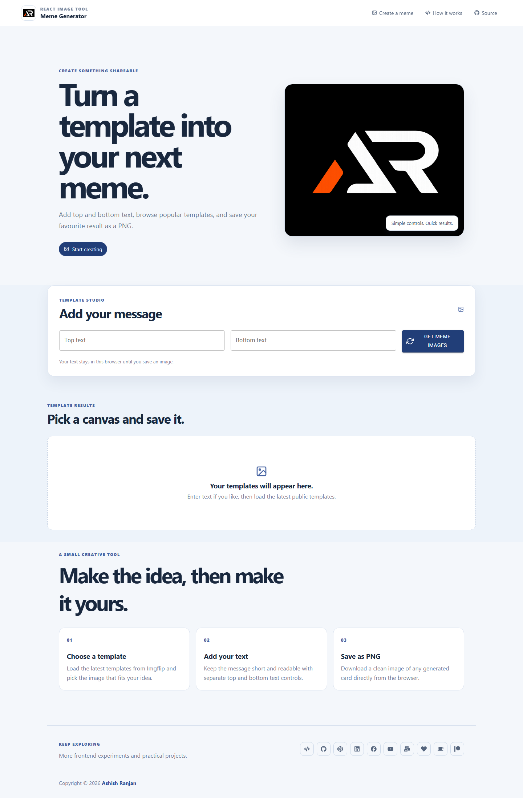

# Meme Generator

A responsive React tool for loading public Imgflip meme templates, adding top and bottom captions, and downloading the selected result as a PNG.



## Features

- Loads current public templates from Imgflip
- Adds editable top and bottom captions
- Responsive template grid with accessible controls
- Saves an individual meme as a PNG from the browser
- Fixed header, mobile menu, local branding assets, icon-only footer links, and go-to-top control

## Tech stack

React, Create React App, Material UI, Sass, Axios, html-to-image, and React Icons.

## Run locally

```bash
npm install
npm start
```

For a production build, run `npm run build`. The template service needs an internet connection when loading images.

## Future scope

The project can grow with caption styling controls, template search, saved drafts, and optional custom image uploads while keeping the current creation flow simple.

## Links

- Portfolio: [https://www.ashishranjan.net](https://www.ashishranjan.net)
- GitHub: [https://github.com/a2rp](https://github.com/a2rp)
- CodePen: [https://codepen.io/ash1198](https://codepen.io/ash1198)
- LinkedIn: [https://www.linkedin.com/in/aashishranjan](https://www.linkedin.com/in/aashishranjan)
- Facebook: [https://www.facebook.com/theash.ashish/](https://www.facebook.com/theash.ashish/)
- YouTube: [https://www.youtube.com/@ashishranjan-ashz?sub_confirmation=1](https://www.youtube.com/@ashishranjan-ashz?sub_confirmation=1)
- Email: [ash.ranjan09@gmail.com](mailto:ash.ranjan09@gmail.com)

## Support

- Support: [https://a2rp-donation-page.netlify.app/](https://a2rp-donation-page.netlify.app/)
- Buy Me a Coffee: [https://buymeacoffee.com/a2rp](https://buymeacoffee.com/a2rp)
- Patreon: [https://patreon.com/a2rp](https://patreon.com/a2rp)